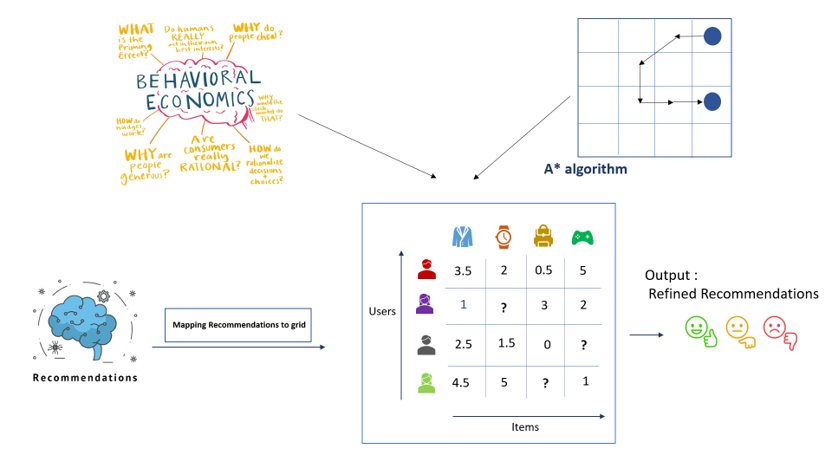

# Mapping-Recommendations-to-A-star :rocket:
A Minor Project 
This repository will contain all the files as I work on Mappin Recommendations to A* Algorithms
  
In this project, we are trying to map recommendations to a grid data structure and apply A* algorithm over it for better results. The aim is to address the limitations of traditional recommendation approaches, such as sparsity [1] and lack of nuance, by providing a structured and efficient method for capturing user preferences and item characteristics. By mapping recommendations to a grid, the system can incorporate user-item interactions, item features, and contextual information, leading to more accurate and personalized recommendations. The A* algorithm aims to improve recommendation quality by finding optimal paths through the recommendation grid. :chart_with_upwards_trend:

### Motivation :bulb:

### Problem Statement :thinking:
To design and implement recommendation mapping to a relevant grid data structure and application of A* algorithm.

### Research Question :question:
How does the grid data structure compare to traditional recommendation approaches in terms of recommendation quality, computational efficiency, and scalability? :bar_chart:

### Initial Design :pencil:

